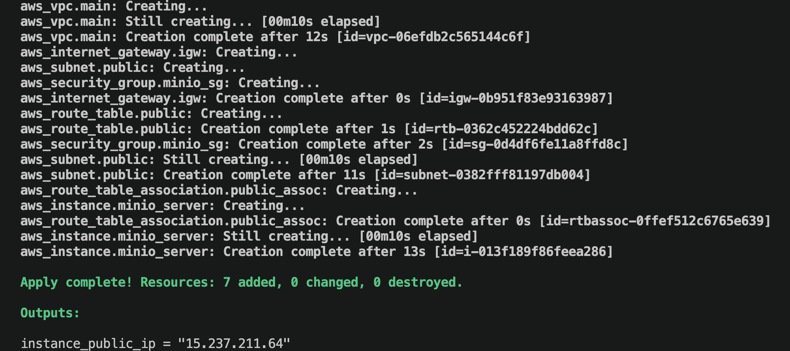
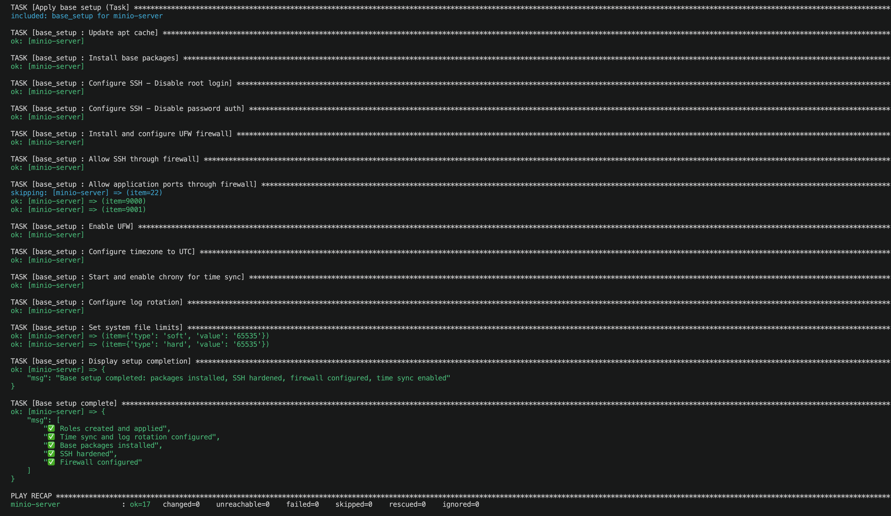

# DevOps Project: MinIO S3 on AWS (Infrastructure as Code)

## Overview

This project demonstrates a production-like deployment of a MinIO S3-compatible object storage service on AWS.

The infrastructure is fully provisioned using Terraform and configured with Ansible, ensuring idempotency, reproducibility, and automation.

The system includes secure HTTPS access, basic monitoring, and operational tooling.

Designed to simulate real-world DevOps workflows and infrastructure practices.

---

## Architecture Diagram (logical)

```md
# Logical Flow

Client → Nginx (80) → MinIO (9000 / 9001)

Routing:

- s3.<domain> → MinIO API

- console.<domain> → MinIO Console
``` 
The solution consists of the following components:

- ### Terraform
  - VPC, subnets, security groups
  - EC2 instance
  - IAM roles and policies
  - Remote state (S3)

- ### Ansible
  - System provisioning and hardening
  - MinIO installation and configuration
  - Systemd service setup

- ### Nginx / AWS ALB
  - HTTPS exposure
  - SSL via ACM (if ALB used)

- ### MinIO
  - S3-compatible object storage service

- ### CloudWatch
  - Logs collection
  - Basic monitoring and alerts

### Nginx Reverse Proxy (Ingress Layer)

Nginx is used as a reverse proxy to expose MinIO services over HTTP.

Instead of accessing MinIO directly via ports:

- `:9000` (API)
- `:9001` (Console)

All traffic is routed through Nginx:

Client → Nginx (port 80) → MinIO backend

Routing is based on domain name:

- `s3.<domain>` → MinIO API
- `console.<domain>` → MinIO Console

This design provides:

- Clean URLs (no ports)
- Centralized access point
- Foundation for HTTPS (TLS termination)
- Ability to restrict direct access to backend services

---

## Features

- Fully reproducible infrastructure (Terraform)
- Idempotent configuration management (Ansible)
- HTTP exposure via Nginx reverse proxy
- HTTPS support (planned via Let's Encrypt)
- Basic logging and monitoring
- Structured project with clear separation of concerns
- Runbook for deployment and troubleshooting

---

## Deployment

The infrastructure is deployed in two stages:

1. ### Base Setup (Ansible)

   - Prepares the EC2 instance

   - Installs and configures MinIO

   - Opens required ports (9000, 9001)

2. ### HTTP Exposure (Nginx)

   - Installs and configures Nginx as a reverse proxy

   - Routes traffic based on domain:

     - `s3.<domain>` → MinIO API (port 9000)

     - `console.<domain>` → MinIO Console (port 9001)

This separation allows independent and idempotent configuration of the application and its public exposure layer.

### Prerequisites

- AWS account
- Terraform
- Ansible
- SSH access

### Steps

1. Provision infrastructure:
```bash
terraform init
terraform apply
```
2. Configure the server:
```bash
ansible-playbook -i inventory.ini playbooks/base_setup.yml
```
3. Expose service via Nginx:
```bash
ansible-playbook -i inventory.ini playbooks/https_exposure.yml
```

---

### Validation

- Infrastructure can be created and destroyed using Terraform
- MinIO is accessible via HTTPS
- Health checks are working
- Logs are collected in CloudWatch
- Configuration is reproducible and idempotent

---

### Repository Structure

```bash
terraform/   # Infrastructure as Code
ansible/     # Configuration management
docs/        # Documentation (optional)
```
--- 

### Tech Stack

- AWS (EC2, S3, IAM, CloudWatch)
- Terraform
- Ansible
- Nginx / ALB
- MinIo
- Linux

---

### Documentation

- Terraform setup: ./terraform/README.md
- Ansible setup: ./ansible/README.md

---

### Demo

### Terraform apply
Infrastructure provisioning using Terraform



### Ansible apply



### MinIO Service
Running S3-compatible object storage on AWS EC2

### Accessing the Service

Once deployed, the service can be accessed via:

- MinIO API:
  http://s3.<domain>

- MinIO Console:
  http://console.<domain>

For local testing without DNS:

```
curl -H "Host: s3.<domain>" http://<EC2_PUBLIC_IP>
curl -H "Host: console.<domain>" http://<EC2_PUBLIC_IP>
```


### Security Notes

Currently, MinIO services are exposed over HTTP via Nginx.

Direct access to backend ports (9000, 9001) is temporarily allowed for testing purposes.

Planned improvements:

- Enable HTTPS using Let's Encrypt (Certbot)
- Enforce HTTP → HTTPS redirection
- Restrict direct access to backend ports (9000, 9001)
- Expose only ports 80 and 443 publicly

### Notes

This project was built as part of hands-on DevOps practice, focusing on real-world infrastructure patterns and automation principles.

Based on: https://github.com/minio/minio
